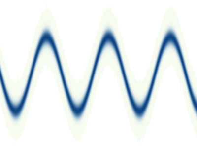

# Line density

Compute a line density with normalization to accurately show density in time series data.

Output of the generated example data:

</img>

## Run

You can pass the number of time series that should be generated as a command line argument. 

### In development mode

`cargo run`

### In release mode

```
cargo build --release
target/release/line-density
```

To run an experiment with one million time series, run `target/release/line-density 1000000`.

## Limitations

The code right now only computes line density for time series data that is generated in the code itself. It needs to be adjusted if you want to compute density of some other time series data. 

## Performance

The current implementation does not use GPUs but it runs the density computation parallel. On a machine with 120 cores, the computation for one million time series takes about 16 seconds.
